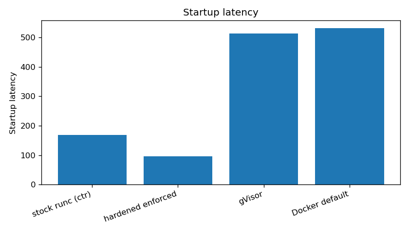
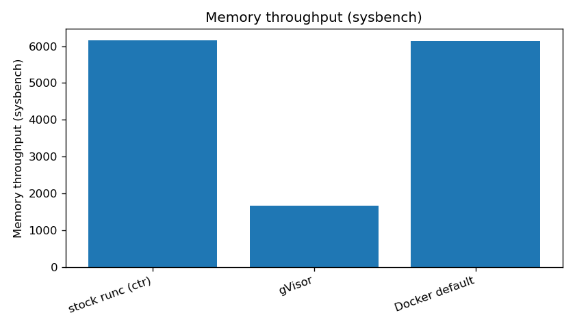
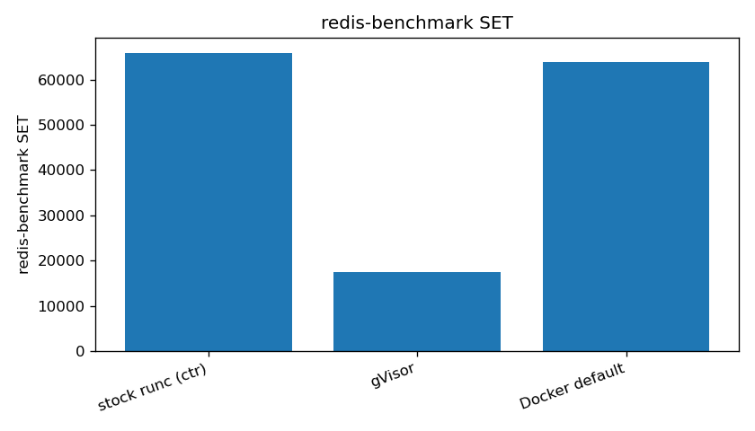
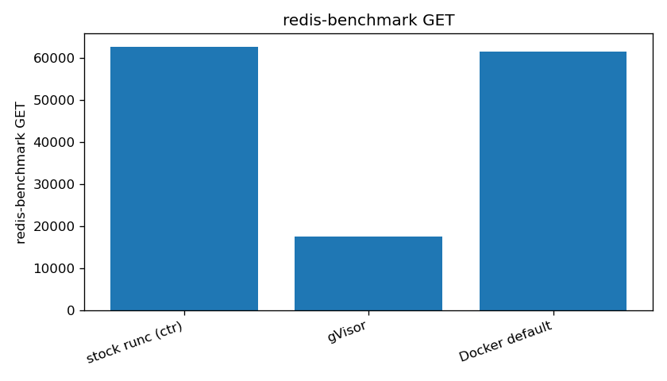

# Benchmark report

Source: `/home/dpttk/performance-evaluation/results/campaign-20260615-005104`

## Host

```
host=performance-testing
date=2026-06-15T00:51:20+00:00
kernel=6.8.0-124-generic
arch=x86_64
cpu_model=AMD EPYC-Genoa Processor
cpu_count=4
virt=kvm
kvm_present=no
mem_total=8130784 kB
cgroup=cgroup2fs
cpu_governor=n/a
turbo_disabled=n/a
os=Ubuntu 24.04.4 LTS
containerd=containerd github.com/containerd/containerd/v2 2.2.1 
docker=Docker version 29.1.3, build 29.1.3-0ubuntu3~24.04.2
runc_stock=runc version 1.5.0-rc.1+dev
runc_hardened=runc version 1.4.0-rc.1+dev
runsc=runsc version release-20260601.0
kata=missing
runtimes_under_test=stock gvisor docker
reps=8 warmup=2
```

## Performance metrics

Values are medians over repeated samples; overhead is relative to `stock` (positive = slower/worse for latency, lower throughput shown as % of stock).


### Startup latency (ms)

| Runtime | median | p95 | stddev | vs stock |
|---|---|---|---|---|
| stock runc (ctr) | 169.00 | 179.90 | 7.79 | +0.0% |
| hardened enforced | 95.50 | 98.65 | 2.29 | -43.5% |
| gVisor | 512.50 | 523.00 | 12.09 | +203.3% |
| Docker default | 530.50 | 581.50 | 66.69 | +213.9% |


### CPU (sysbench) (events/s)

| Runtime | median | p95 | stddev | vs stock |
|---|---|---|---|---|
| stock runc (ctr) | 1,637 | 1,637 | 0.30 | 100% of stock |
| gVisor | 1,610 | 1,610 | 0.07 | 98% of stock |
| Docker default | 1,637 | 1,637 | 0.14 | 100% of stock |


### Memory throughput (sysbench) (MiB/s)

| Runtime | median | p95 | stddev | vs stock |
|---|---|---|---|---|
| stock runc (ctr) | 6,158 | 6,162 | 4.02 | 100% of stock |
| gVisor | 1,667 | 1,677 | 10.43 | 27% of stock |
| Docker default | 6,143 | 6,169 | 28.43 | 100% of stock |


### Network (iperf3 loopback) (Gbit/s)

| Runtime | median | p95 | stddev | vs stock |
|---|---|---|---|---|
| stock runc (ctr) | 31.94 | 32.23 | 0.21 | 100% of stock |
| gVisor | 22.39 | 23.04 | 0.39 | 70% of stock |
| Docker default | 31.94 | 32.36 | 0.23 | 100% of stock |


### redis-benchmark SET (req/s)

| Runtime | median | p95 | stddev | vs stock |
|---|---|---|---|---|
| stock runc (ctr) | 65,862 | 66,757 | 1,515 | 100% of stock |
| gVisor | 17,422 | 17,767 | 201.47 | 26% of stock |
| Docker default | 63,967 | 64,929 | 2,266 | 97% of stock |


### redis-benchmark GET (req/s)

| Runtime | median | p95 | stddev | vs stock |
|---|---|---|---|---|
| stock runc (ctr) | 62,632 | 64,281 | 1,890 | 100% of stock |
| gVisor | 17,564 | 17,664 | 80.63 | 28% of stock |
| Docker default | 61,593 | 65,119 | 3,026 | 98% of stock |


## Enforcement-mode overhead

- Workload: `synthetic`
- One-time scan (profile generation) cost: **3441 ms**
- Generated seccomp allowed syscalls: **56**
- Functional preserved (raw == enforced output): **True**
- raw median: 469.00 ms; enforced median: 506.00 ms
- **Steady-state enforcement overhead: 7.89%**


## Plots











