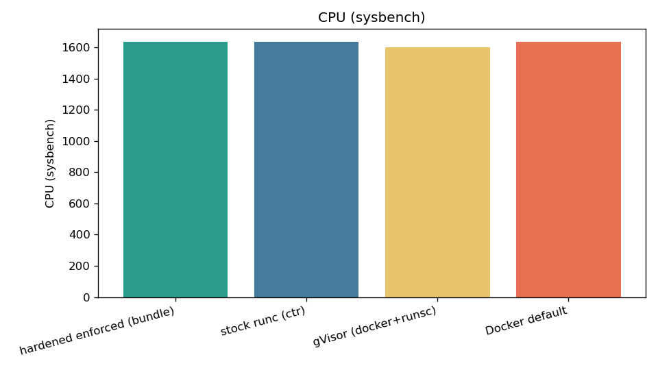
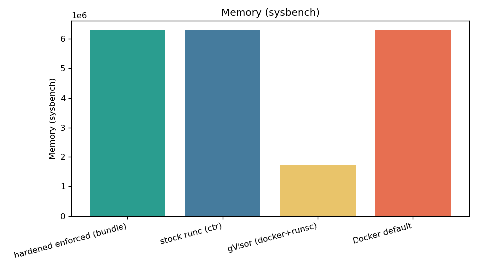
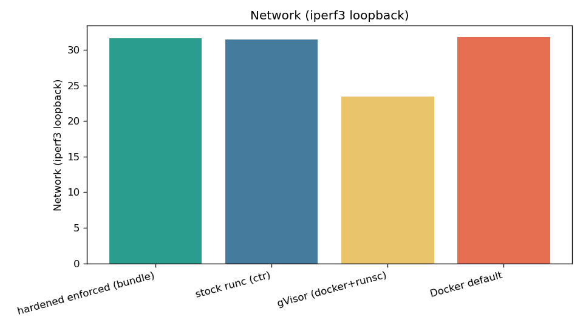
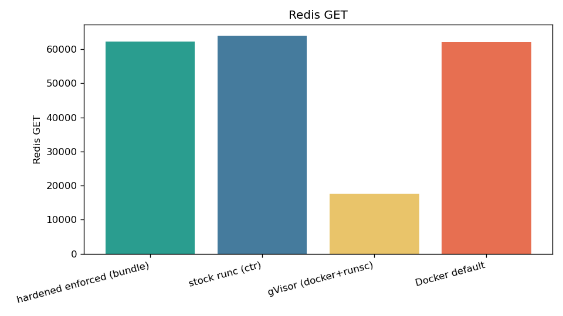

# Benchmark Report

Source: `/home/dpttk/performance-evaluation/results/campaign-20260615-225323`

Primary subject: **hardened enforced (bundle)**

## Test Environment

```
host=performance-testing
date=2026-06-15T22:56:04+00:00
kernel=6.8.0-124-generic
arch=x86_64
cpu_model=AMD EPYC-Genoa Processor
cpu_count=4
virt=kvm
kvm_present=no
mem_total=8130784 kB
cgroup=cgroup2fs
cpu_governor=n/a
turbo_disabled=n/a
os=Ubuntu 24.04.4 LTS
containerd=containerd github.com/containerd/containerd/v2 2.2.1 
docker=Docker version 29.1.3, build 29.1.3-0ubuntu3~24.04.2
runc_stock=runc version 1.5.0-rc.1+dev
runc_hardened=runc version 1.4.0-rc.1+dev
runsc=runsc version release-20260601.0
kata=missing
runtimes_under_test=stock gvisor docker hardened_enforced
reps=50 warmup=10
profiles_dir=/home/dpttk/performance-evaluation/profiles
launcher_stock=ctr+/usr/local/sbin/runc-stock
launcher_hardened_enforced=/usr/local/sbin/runc-hardened run --bundle
launcher_gvisor=docker(--runtime=runsc)
launcher_docker=docker(default)
```

## Performance Metrics

Medians over repeated samples. 'vs enforced' expresses baseline deviation from the primary subject (positive latency = slower than enforced; throughput shown as % of enforced).


### CPU (sysbench) (events/s)

| Runtime | Launcher | median | p95 | stddev | vs enforced |
|---|---|---|---|---|---|
| hardened enforced (bundle) | runc bundle | 1,635 | 1,636 | 1.21 | — |
| stock runc (ctr) | containerd/ctr | 1,636 | 1,637 | 0.99 | 100% of enforced |
| gVisor (docker+runsc) | docker | 1,602 | 1,609 | 5.40 | 98% of enforced |
| Docker default | docker | 1,636 | 1,637 | 1.22 | 100% of enforced |


### Memory (sysbench) (MiB/s)

| Runtime | Launcher | median | p95 | stddev | vs enforced |
|---|---|---|---|---|---|
| hardened enforced (bundle) | runc bundle | 6,286,346 | 6,311,036 | 41,989 | — |
| stock runc (ctr) | containerd/ctr | 6,285,693 | 6,313,693 | 51,904 | 100% of enforced |
| gVisor (docker+runsc) | docker | 1,719,072 | 1,762,526 | 22,328 | 27% of enforced |
| Docker default | docker | 6,288,487 | 6,309,098 | 45,875 | 100% of enforced |


### Network (iperf3 loopback) (Gbit/s)

| Runtime | Launcher | median | p95 | stddev | vs enforced |
|---|---|---|---|---|---|
| hardened enforced (bundle) | runc bundle | 31.60 | 31.86 | 0.24 | — |
| stock runc (ctr) | containerd/ctr | 31.50 | 32.10 | 0.33 | 100% of enforced |
| gVisor (docker+runsc) | docker | 23.40 | 24.95 | 0.66 | 74% of enforced |
| Docker default | docker | 31.80 | 32.20 | 0.37 | 101% of enforced |


### Redis SET (req/s)

| Runtime | Launcher | median | p95 | stddev | vs enforced |
|---|---|---|---|---|---|
| hardened enforced (bundle) | runc bundle | 62,162 | 62,969 | 799.96 | — |
| stock runc (ctr) | containerd/ctr | 64,037 | 64,894 | 678.84 | 103% of enforced |
| gVisor (docker+runsc) | docker | 17,636 | 17,765 | 83.00 | 28% of enforced |
| Docker default | docker | 62,089 | 63,160 | 718.84 | 100% of enforced |


### Redis GET (req/s)

| Runtime | Launcher | median | p95 | stddev | vs enforced |
|---|---|---|---|---|---|
| hardened enforced (bundle) | runc bundle | 62,224 | 63,335 | 934.06 | — |
| stock runc (ctr) | containerd/ctr | 63,959 | 65,097 | 709.19 | 103% of enforced |
| gVisor (docker+runsc) | docker | 17,594 | 17,727 | 100.34 | 28% of enforced |
| Docker default | docker | 62,050 | 63,206 | 751.22 | 100% of enforced |

## Cold-Start Wall Time (first measured rep, ms)

| Workload | hardened enforced (bundle) | stock runc (ctr) | gVisor (docker+runsc) | Docker default |
|---|---|---|---|---|
| CPU (sysbench) | 10089 | 10183 | 10597 | 10527 |
| Memory (sysbench) | 418 | 536 | 1787 | 974 |
| Network (iperf3 loopback) | 32090 | 32189 | 32552 | 32417 |
| Redis SET | 17548 | 16678 | 57987 | 17693 |
| Redis GET | 17548 | 16678 | 57987 | 17693 |


## Plots










